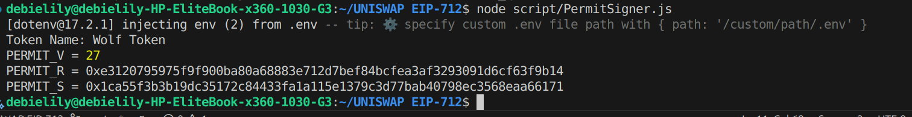

# PermitSwap - EIP-712 Gasless Token Swapping

## Overview

This project implements a gasless token swapping mechanism using EIP-712 signatures and Uniswap V2. It allows users to swap tokens without needing ETH for gas fees by using permit signatures for token approvals.

## Contracts

### 1. PermitSwap.sol
The main contract that enables gasless token swaps through EIP-712 permit signatures.

**Key Features:**
- **Gasless Approvals**: Uses EIP-712 permit signatures instead of traditional approve transactions
- **Uniswap Integration**: Swaps tokens through Uniswap V2 Router
- **Single Transaction**: Combines permit and swap in one transaction

### 2. WolfToken.sol (WTK)
An ERC20 token with permit functionality for testing the PermitSwap contract.

**Features:**
- ERC20Permit implementation (EIP-2612)
- Initial supply: 1,000,000 WTK
- Symbol: WTK
- Deployed at: `0xd6e1afe5ca8d00a2efc01b89997abe2de47fdfaf`

## How It Works

1. **Off-chain Signing**: Users sign an EIP-712 permit message allowing the PermitSwap contract to spend their tokens
2. **Permit Execution**: The contract uses the signature to approve token spending without requiring a separate transaction
3. **Token Transfer**: Transfers tokens from user to the contract
4. **Uniswap Swap**: Approves and swaps tokens through Uniswap V2 Router
5. **Token Delivery**: Sends swapped tokens to the specified recipient

## Deployment

### Contracts Deployed on Lisk Sepolia:
- **WolfToken (WTK)**: `0xd6e1afe5ca8d00a2efc01b89997abe2de47fdfaf`
- **PermitSwap**: `0xB0f05d25e41FbC2b52013099ED9616f1206Ae21B`

**Verification**: 

[View PermitSwap on Etherscan](https://sepolia-blockscout.lisk.com/address/0xB0f05d25e41FbC2b52013099ED9616f1206Ae21B)

[View WTK on Etherscan](https://sepolia-blockscout.lisk.com/address/0xd6e1afe5ca8d00a2efc01b89997abe2de47fdfaf)

